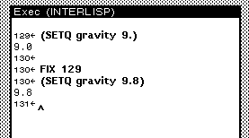
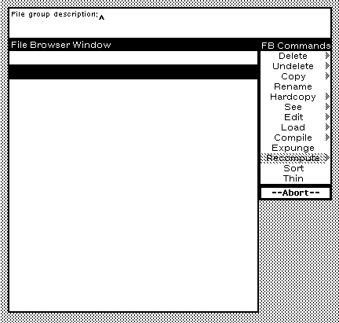
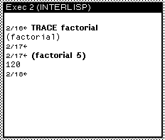
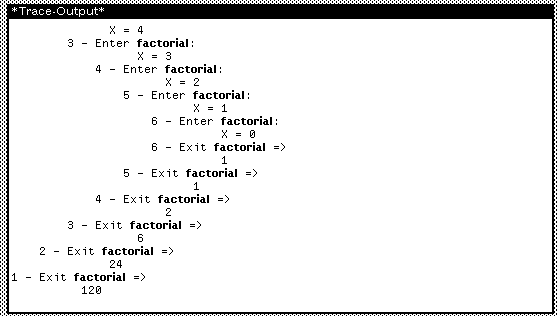

# Debugging

Part of what sets Medley apart is a collection of dedicated functions and features to help us debug our programs.

#### **FIX and ED**

`FIX line-number` :

`FIX` lets us edit whatever we typed at a certain line number. It's useful when we want to make an immediate change.

<figure><figcaption></figcaption></figure>


Remember, we can refer to line numbers from any Exec. You might find it helpful to work with multiple smaller Execs, each focusing on a unique function of the larger program.


Back In the SEdit chapter, we learned about editing the definition of a function with `(DF function-name)`, which Medley internally translates to `(ED 'NAME '(FUNCTIONS FNS :DONTWAIT))`. You don't need to use this expanded form but it's good to know what goes on in the background.&#x20;

&#x20;`(ED 'function-name)`:

While `DF` is for editing functions only, `ED` is the default editor function we can use to edit any File Manager object, including function definitions, variable values, property lists, or file package commands through SEdit.


The :DONTWAIT statement in DF's mapping to ED enables function edits to be tested in the Exec without needing to compile first. Try both DF and ED to edit a function. Does one of them let you switch to the Exec freely? Which one restricts you to SEdit?


***

#### **INSPECT**

At times, you will define variables that are larger, more complex than an atom. As our programs grow larger, we might want to take a quick look at the contents of these variables in an organized, tabular format without opening an editor like SEdit:

<figure><figcaption></figcaption></figure>

`INSPECT`allows us to do exactly that:

<figure><figcaption></figcaption></figure>

Select **Inspect** from menu and a window appears with two columns. The first column displays the numbered positions of the list items and the second column displays the item in that position.

<figure><figcaption></figcaption></figure>


Notice how we use quote (') before the variable name when we need to edit the definition of the variable. The system does not need to evaluate or understand the contents. It only needs to display the contents for us to make changes. Quote (') tells Lisp not to evaluate or "run" what follows.\
\
But when it comes to Inspect, we do want the system to understand the contents of the list so it can organize and display it neatly for us to review. No quotes for that operation!


***

#### BREAK

Breaking a function lets us halt the function midway and interrogate what could be going wrong in a dedicated Break Window. We can break and unbreak entire functions. This is handy when your function is huge, complex and expensive to compute. We can also insert conditional breakpoints inside a function that breaks the function if certain criteria are met. This is useful when you want to ask questions about the flow of data through your program. Or when you want your program to stop its operation if (as opposed  to printing the state and continuing).


If you're stuck in an infinite loop or just want to break out of the current running function, use **Ctrl + B.**


In a COND, use `(CL: BREAK "Something meaningful to print about the break")` to trigger a break at a particular point.

Let's define a function that prints out the factorial of any given number.

<figure><figcaption></figcaption></figure>

Factorials can be quite large. Suppose, we want to limit the program so only factorials of numbers no greater than 10 are printed. Pull up SEdit to edit the function `factorial`. Add another condition to the COND block:&#x20;

`((GREATERP X 10)(CL: BREAK "This number is too large. X should be smaller than 10"))`

This tells Medley to break the function if X is greater than 10.

<figure><figcaption></figcaption></figure>

Once the new function is compiled, try a few different values to test if it's working as intended.&#x20;

For `(factorial 11)`, or any number larger than 10, you should see the break window appear with your message:

<figure><figcaption></figcaption></figure>

***

#### TRACE

When your program is not acting as intended, the final output might not necessarily reveal what you need to fix. Being able to look at the internal calculations your functions are making and what output it generates at every step is a useful feature and TRACE lets us do exactly that.&#x20;

Let's trace our factorial function.

<figure><figcaption></figcaption></figure>

After we've traced a function with `TRACE function-name`, executing the function will open a Trace-Output window:

<figure><figcaption></figcaption></figure>

***

#### ADVISE

