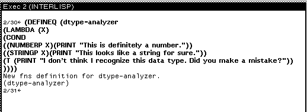
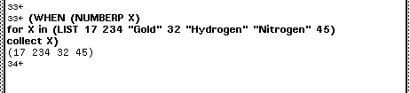

# Loops and Conditionals

Medley offers a set of useful functions and operators for conditionals and loops (e.g., COND, IF, AND, OR, FOR, WHILE). It also provides us with a list of functions to compare our data and understand its type.

You can refer to the [IRM](https://interlisp.org/documentation/IRM.pdf)'s Chapter 9, "Lists and Iterative Statements," for an exhaustive list of available options. Here are a select few as examples:

`(FLOATP X)`: Returns x if x is a floating point number. Otherwise returns NIL.

`(NUMBERP X)`: Returns x if x is a number of any type. Otherwise returns NIL.

`(STRINGP X)`: Returns x if x is a string. Otherwise returns NIL.

`(EQP X Y)`: Returns T if x and y are numbers and equal in value. Otherwise returns NIL.

`(EQUAL X Y)`: Returns T if X and Y are numbers with equal value, or strings with the same sequence of characters, or lists where CAR of X and Y and CDR of X and Y are equal. Otherwise returns NIL.

#### Conditionals

You may have used if/else statements in other programming languages. `COND` can be used to chain together multiple if/else logic concisely. You can consider it similar to `match` blocks.

A verbose conditional block like `(if A then B else if C then D else E)` can be rewritten instead as:

`(COND (A B)(C D)(T E))`


T marks the default value. If all previous condition checks return NIL, then the argument following T is evaluated.


The arguments after COND are referred to as clauses.&#x20;

(COND CLAUSE1 CLAUSE2 CLAUSE3 ... CLAUSEN)

Each clause is evaluated in order and is a list of the form (P1 C1 ... C1N). Here, P is the condition to be checked. If P1 returns true, then C1 to C1N are evaluated sequentially. If P1 is not true, then we evaluate P2 and then P3, and so on. If none of the conditions are true, then `COND` returns NIL.

***

**Do it yourself:** Write a small function using COND to identify whether a value is a string or a number and print that answer.

Your function should look similar to this:

<figure><figcaption></figcaption></figure>

***

#### Loops

Similar to other languages, you can use operators like FOR and WHILE to set up loops.

`(for X from 1 to 5 do (PRINT X)`

Medley has a large collection of iterative statement operators. Check out the IRM's _Conditionals and Iterative Statements_ chapter for a full list. Here's a small collection:

`DO`: Evaluates the form/argument for each iteration.

`COLLECT`:  Puts the value of all iterations in a list.

`JOIN`: Returns a list with all values concatenated.

`SUM`: Returns the sum of all values.

`FROM`: Specifies the starting value.

`TO`: Specifies the end value.

`IN`: Finds one instance of a matching element from a list with each iteration.

`WHEN`: Only runs when the condition is met.

***

Let's write a loop to collect all the numbers from a list of mixed data in a new list. Try doing it yourself. Does it match:

<figure><figcaption></figcaption></figure>

