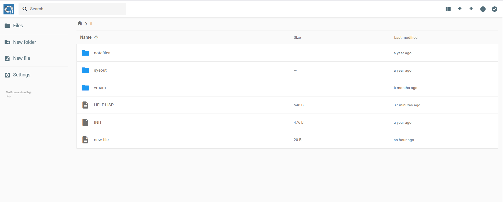

# Medley Online and Medley Local

#### When to choose which?

You can run Medley either online (through a web browser) or locally. Both are fully capable environments, so rest assured, you don't have to compromise on the features available to you. Choose the online version if you want quick and easy access to Medley. You can log in as a guest and start poking around right away. When you're ready to dive deeper and want to keep track of files and retain the state of your environment across sessions, you can create a free account. Use that to log in for your next sessions. Check out [Access Medley Online](https://interlisp.org/software/access-online/) if you have more questions.

If you prefer a more hands-on, web-independent approach, you can build Medley on your computer. Refer to the documentation here: [Install and Run](https://interlisp.org/software/install-and-run/), to learn more about how to get Medley installed on your specific operating system.&#x20;

Both the online and local versions of Medley let you create, save, and edit files and save the current state of your Medley environment. But the process of doing so differs slightly. Medley's `SYSOUT`\
function saves the current state of Medley's virtual memory in a "sysout file". The section titled _Saving Virtual Memory State_ in the [Interlisp Reference Manual](https://interlisp.org/documentation/IRM.pdf) can tell you more about SYSOUT's possibilities.

**Accessing Files**

Once inside Medley Online, to your very left, you'll find a sidebar expandable with a left-arrow icon.&#x20;

 &#x20;

We'll talk about the other options this sidebar provides. For now, let's focus on the first one, a useful virtual file manager. Click, and you should see a warning that the file manager will open in a new window. Go ahead and press Ok. A new tab should appear in your browser with the following window:

<figure><figcaption></figcaption></figure>

Right above, the text "Name", you'll notice that all our important files are stored inside a folder titled "il".&#x20;

If you're running Medley locally, your system files are also inside a folder titled "il" but your saved files will be in a nested subfolder titled "home". So, when you save files in Medley Online, it's saved to the path `il/`

When you save files in Medley Local, your files are saved to the path: `il/home/username/il/`


The first "il" is the default name of the folder where Medley is installed, inside the drive you chose during the installation process.

"username" will, of course, be replaced by your username.


For example, I saved a PDF from TEdit by typing out the file name and not the full path. Medley let me know that it has been saved to:

<figure><figcaption></figcaption></figure>


Here, {DSK} refers to the folder titled "il" containing your Medley installation.


I installed Medley on the R drive, in the Installations/Programs folder. So, I can find the file I just saved at:

<figure><figcaption></figcaption></figure>


The Medley installation shown above is on Windows 11. Your file paths may slightly vary on other operating systems. For a quick check, try saving a file, and Medley will print out where it's being saved to by default. To learn how to save files, take a look at the chapters: Saving Your Work and TEdit, The Text Editor.


As we learn to use `LOAD` , `MAKEFILES`, and other helpful functions related to handling files in Medley Interlisp, we don't need to change our file paths while using either version of Medley, but it's good to be aware where they are located so we can use that information later to organize our files better.
