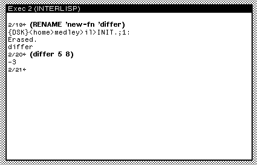

# Editing functions with SEdit

Medley's Structure Editor, or SEdit, is a program for editing your code. While the Exec is a central hub for interacting with Medley, SEdit is a dedicated window for making changes to the functions, variables, macros, and data structures we have defined. Remember, all Lisp code is made up of lists, which, regardless of size and shape, can be read by Medley as a data _structure_. Just like the File Manager, SEdit interacts with live Lisp objects in memory. So, objects loaded from files and edited by SEdit still need to be saved using `MAKEFILES` , like we learned in the previous chapter.&#x20;

Let's define an incomplete function we'll want to edit to fix. In your Exec, type:

`(DEFINEQ (new-fn (LAMBDA  (X Y)(X Y)))))`

Right now, our function doesn't do anything. Trying to execute the function with two arguments outputs: "X is an undefined function".&#x20;

We want to make two changes to `new-fn`:

1. Edit the function to output the difference of X and Y instead.
2. Rename the function to a more appropriate name: `differ`

There are several functions that can be used to call/launch SEdit. Refer to Chapter 16 of the IRM to learn more about SEdit's capabilities. For now, we'll focus on the function to edit the definition of a function: `(DF function-name)`

In the Exec, type:\
`(DF new-fn)`

You will see a new window appear on your screen with the title: SEdit new-fn Package: INTERLISP

<figure><figcaption></figcaption></figure>

Click on a part of the code, and you'll see a blinking text cursor appear in place. You can either: Left-click beside a symbol to type new items or left-click on a symbol to edit it. A selected symbol will be underlined. Click the middle-mouse button on a selected object to select different layers of its parents. So, middle-mouse on an item in our list `(X Y)` will first select the entire list and a subsequent click will select the entire function.

We are trying to change this function into one that'll give us the difference between X and Y. Try editing the function to put a minus before X. It should look like:

<figure><figcaption></figcaption></figure>

Now, click the middle-mouse button on the black title bar to see a new menu appear:

<figure><figcaption></figcaption></figure>

Select the option Done, Compile, and Close to update our function. We are going to test our new function soon. But first, let's update the name to match what it does.&#x20;

We can use the `RENAME` function to change the name of a symbol- for example, the name of a function. The general form is: `(RENAME 'old-function-name 'new-function-name)` .&#x20;

In the Exec, type:

`(RENAME 'new-fn 'differ)`

Our function name has now been changed from `new-fn` to `differ` . Try out the function and see if it works:

<figure><figcaption></figcaption></figure>

#### **Comments**

We can add comments in SEdit, using a semicolon.&#x20;

Three levels of comments are supported in Medley. According to the Interlisp Reference Manual:

> Single-semicolon comments are formatted at the comment column, about three-quarters of the way across the window. Doublesemicolon comments are formatted at the current indentation of the code they are in. Triple semicolon comments are formatted against the left margin. The level of a comment can be increased or decreased by pointing after the semicolon, and either typing another semicolon, or backspacing over the preceding semicolon.

#### Useful Key Combinations

| Operation                    | Input/Key Combination                                                                                                                                                                                     | Description                                                                                                                     |
| ---------------------------- | --------------------------------------------------------------------------------------------------------------------------------------------------------------------------------------------------------- | ------------------------------------------------------------------------------------------------------------------------------- |
| Copy and Paste Selected Text | Left-click and move the cursor to the position where you want the copied text to be moved/pasted to. Hold SHIFT while selecting (Left or Middle mouse button) the text to copy. Let go of SHIFT to paste. | Inserts the selected text at the text cursor position.                                                                          |
| Cut and Paste Selected Text  | Hold CTRL + SHIFT while making a mouse selection. Let go to paste.                                                                                                                                        | Combines copy and delete actions, moving the selected text to the text cursor position.                                         |
| Undo Deletion                | Alt + U (Windows and Linux), Option + U (Mac OS)                                                                                                                                                          | Undos recently deleted text.                                                                                                    |
| Delete Selected Text         | Hold CTRL while making a mouse selection (Left or Middle button)                                                                                                                                          | Deletes the selected text.                                                                                                      |
| Parenthesize                 | 
Alt/Option+ ( 

or Alt/Option + )
                                                                                                                                                             | Encapsulates the selected text in parenthesis.                                                                                  |
| Delete Backward (Word/Atom)  | 
Control-W  In some environments, most notably Medley Online, Control-W closes the current browser tab or window. This behavior can be neutralized with Meta+Control+W.
                       | Deletes the previous atom or structure. If the cursor is inside an atom, it deletes backward only to the beginning of the atom. |
| Find Forward                 | Alt/Option + F                                                                                                                                                                                            | Finds the next occurrence of a specified structure (or the currently selected structure).                                       |
