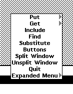

# TEdit, The Text Editor

TEDIT is Medley's native text editor. You can use it to create and edit text files. Several formatting options to change the appearance of the text and the page, including features like inserting images, are available.

To open TEDIT, hold down right mouse button in an empty area on the screen and select TEDIT from the menu that appears.

<figure><figcaption></figcaption></figure>

Click, drag, and let go to create your editor window.  You can start writing:

<figure><figcaption></figcaption></figure>

To change the cursor's position, left-click at the new position or drag while holding down the left mouse button near existing text. Use the middle mouse button instead if you want to select a word. To highlight and select larger segments of the text, hold down the right mouse button and drag over the intended section. To deselect, left-click on an empty space inside the editor.

The white bar at the top is the prompt pane, which will display information about TEDIT as we take certain actions.

Press and hold the middle mouse button on top of the black title bar of the TEDIT window. This menu should appear:

<figure><figcaption></figcaption></figure>

You can change the appearance of your text just like modern text editors. There are a couple of ways to do that, but the easiest is to pull up the TEdit Buttons menu. From the menu shown above, select Buttons. You should see the following menu appear at the bottom of your screen:

<figure><figcaption></figcaption></figure>

Try giving your text a different format. When you left-click on any one of these buttons, you'll see a brief description of the changes above the title bar.

<figure><figcaption></figcaption></figure>

To remove all formatting, use the Defaults button.

<figure><figcaption></figcaption></figure>

We can access more functions through the Expanded Menu. Select it by hovering over it in the menu and letting go of the mouse button. A new panel titled TEdit Menu should appear above your TEdit window.

<figure><figcaption></figcaption></figure>

Options like Page Layout, Char looks, and Para looks will open their respective menus on top of the expanded menu.

<figure><figcaption></figcaption></figure>

#### Saving TEdit Files

We can save our text in either plain text format or as a PDF. Hold down the right mouse button on top of the black title bar. Expand the menu item Hardcopy and select File.

<figure><figcaption></figcaption></figure>

