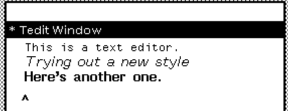
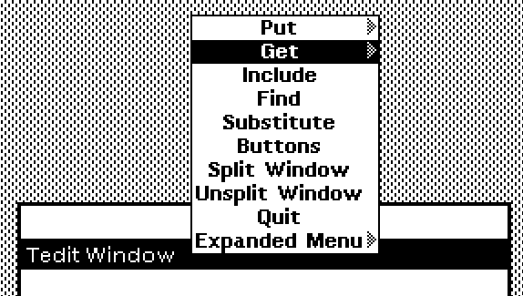
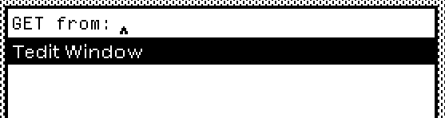

# TEdit, The WYSIWYG Text Editor

TEdit is Medley's native text editor. You can use it to create and edit text files. Several formatting options to change the appearance of the text and the page, including features like inserting images, are available.

To open TEdit, hold down the right mouse button in an empty area on the screen and select TEdit from the menu that appears.

<figure><figcaption></figcaption></figure>

Click, drag, and let go to create your editor window.  You can start writing:

<figure><figcaption></figcaption></figure>

To change the cursor's position, left-click at the new position or drag while holding down the left mouse button near existing text. Use the middle mouse button instead if you want to select a word. To highlight and select larger segments of the text, hold down the right mouse button and drag over the intended section. The region to the left of the text is special: If you left-click there, you select the line. If you middle-click there, you select the paragraph. To deselect, left-click on an empty space inside the editor.

The white bar at the top is the prompt pane, which will display information about TEdit as we take certain actions.

Press and hold the middle mouse button on top of the black title bar of the TEdit window. This menu should appear:

<figure><figcaption></figcaption></figure>

You can change the appearance of selected text just like modern text editors. There are a couple of ways to do that, but the easiest is to pull up the TEdit Buttons menu. From the menu shown above, select Buttons. You should see the following menu appear at the bottom of your screen:

<figure><figcaption></figcaption></figure>

Try giving your text a different format. When you left-click on any one of these buttons, you'll see a brief description of the changes above the title bar.

<figure><figcaption></figcaption></figure>

To set the format to the document's default, click the Defaults button.

<figure><figcaption></figcaption></figure>

#### Persistent Menus: Apply, Show, and Neutral

We can access more functions through the Expanded Menu. These menus are persistent: they will stay at the position they appear till we close them. Select the Expanded Menu by hovering over it in the menu and letting go of the mouse button. A new panel titled TEdit Menu should appear above your TEdit window.

<figure><figcaption></figcaption></figure>

Options like Page Layout, Char looks, and Para looks will open their respective menus on top of the expanded menu.

<figure><figcaption></figcaption></figure>

The expanded menu gives us a lot of options to change the look and layout of our text and the page. Except for APPLY, SHOW, and NEUTRAL, in the persistent menu, some menu items have three states (On, Off, Neutral) and some have two states (On and Neutral):


These three states can either be applied or removed from your selected text or to your page. Remember, you can select a piece of text by using the left mouse button for selecting letters, the middle mouse button for selecting words, and holding down and dragging the right mouse button over larger chunks of text like sentences and paragraphs.&#x20;


On:

A left-click selects and turns on a menu item in the persistent menus. This change is now ready to be applied to the selected text.

<figure><figcaption></figcaption></figure>

Off:

Another left-click shows an oblique line across the option, indicating that the option is now off. The change is now ready to be removed from the selected text.

<figure><figcaption></figcaption></figure>

Neutral:

Another left-click removes either the on or off state and returns the option to a neutral state, indicating that this change is no longer in effect.&#x20;

<figure><figcaption></figcaption></figure>

APPLY:

This applies the changes to the selected text.

SHOW:

This shows which options have been applied and turned off for the selected text. It's useful when we've applied multiple changes to our text and/or our page.

NEUTRAL:

This returns all active and selected menu items to neutral. It's the default state of the persistent menus.


Two-state menu items, like the fonts, cannot be turned off. We simply switch to a different option than the currently active one and apply it.


#### Reading TEdit Files

#### Opening an existing TEdit file:

From TEdit's context menu, we click on Get.

<figure><figcaption></figcaption></figure>

Then type the file name.

<figure><figcaption></figcaption></figure>

#### Opening a plain text file in TEdit:

From TEdit's context menu, we can expand Get and select Unformatted Get.

<figure><figcaption></figcaption></figure>

Just like Put, we'll be prompted for a file path, which for the online version of Medley can just be the file name.

<figure><figcaption></figcaption></figure>

The file we saved earlier, plain-text.txt, has now been imported to TEdit for us to edit.

<figure><figcaption></figcaption></figure>

#### Saving TEdit Files

We can save ("put") our text as formatted text, plain text, or render ("hardcopy") it to a PDF file.&#x20;

To create a PDF:\
Hold down the right mouse button on top of the black title bar. Expand the menu item Hardcopy and select File.

<figure><figcaption></figcaption></figure>

The following window will appear, asking for a file name:

<figure><figcaption></figcaption></figure>

Type your file name, making sure it ends with .pdf.

<figure><figcaption></figcaption></figure>

To save a plain text file:

Hold down the middle mouse button on top of the black title bar. Expand the menu option Put and select Plain-Text.

<figure><figcaption></figcaption></figure>

You'll see a prompt appear above the title bar, asking for the path to save the file.&#x20;

<figure><figcaption></figcaption></figure>

We can get away with writing just our file name and extension. Medley will store it in the connected directory.

<figure><figcaption></figcaption></figure>

<figure><figcaption></figcaption></figure>

