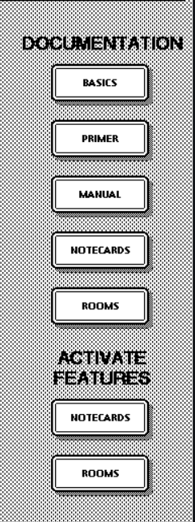

# Understanding and Navigating the Interface

Right after you start Medley, [assuming you've used -a flag to load the full version](#user-content-fn-1)[^1], you should see five four distinct sections making up the interface on your screen.&#x20;

#### The Executive Window

The Executive Window or Exec on the left is the primary window where we can write programs and write code to run other features of Medley Interlisp. There are two flavors of the executive window: Interlisp and Common Lisp (this information is mentioned right beside "Exec" in the title bar and  Line 2).&#x20;

You can create more executive windows in your LISP flavor of choice through the EXEC menu item. Keep on reading to learn more about menus. Yes, you can have multiple executive windows present at the same time.

When you start Medley, the default executive window prints some system information (which you can ignore) followed by the flavor. A blinking caret in the form of an up arrow on Line 3 tells you the system is ready for input. This is where we'll type (for now! 😉).

<figure><figcaption></figcaption></figure>

❕When you have multiple executive windows open, each Exec keeps track of which number of window it is (as in: is this the second or third or the seven-hundredth exec) and the line number in relation to the other execs present. So, if you're on Line 8 on one window, the new line when you switch to a new window will be Line 9, even if the previous line was something else.

#### Prompt Window:

The prompt window at the top-left part of the screen (on top of the starting Exec) is a dedicated area for displaying system prompts and messages. We can print our own text here as well.

<figure><figcaption></figcaption></figure>

#### Help and Features:

On your right is a section titled Documentation. It's a list of web links to helpful resources to aid you during your time with Medley Interlisp. As a beginner, the PRIMER is a good place to start. BASICS will take you to the Medley Interlisp Project website's Documentation page. Take your time to browse around because chances are the team behind the project has already answered some of the more common questions and curiosities. MANUAL leads to the Interlisp Reference Manual (IRM). Refer to the IRM when you want to know more about certain aspects of Interlisp and when you're ready to move beyond the primer. We'll learn about Notecards and Rooms in later chapters.

<figure><figcaption></figcaption></figure>

Menus:

To open a menu, _hold_ right-click on any empty space on the screen. The following menu should appear. Because Medley Interlisp is a 30-year-old system, navigating the interface is slightly different than the modern computers we are used to. But fear not; your mouse and keyboard are all you need!&#x20;

To select or click a menu item: While holding the right-click, move your cursor to the option you want to select and let go of the right-click. The menu will disappear, but the system already knows the window you want to call, so left-click again and drag to create the window for the option you selected.

To expand a menu item: While holding right-click, with the cursor on the item you want to expand, hold left-click and slide right- the expanded menu should appear! You can let go the left mouse button once the expanded menu appears, but keep the right button pressed and select any one of the new options just like any other menu item.&#x20;

<figure><figcaption></figcaption></figure>

When you right-click on a window instead of an empty area, a slightly different menu appears. This is the context menu for that window. You can use this to close, resize, clear, or shrink the window!

<figure><figcaption></figcaption></figure>

[^1]: correct later
